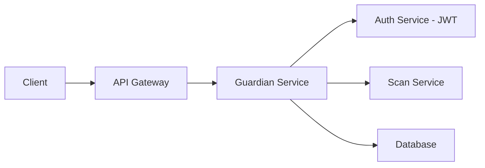
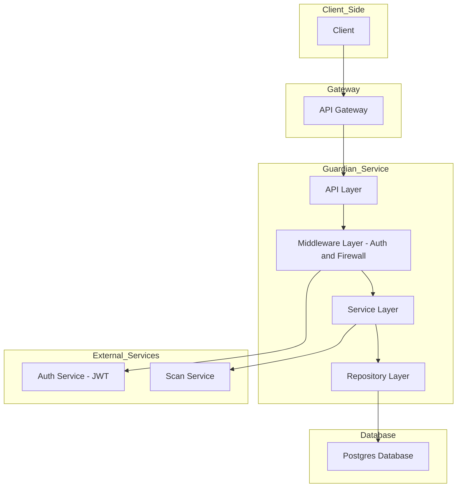

# 🛡️ تحليل وتصميم خدمة "Guardian"

**📅 التاريخ:** 15-06-2025  
**✍️ كاتب الملاحظات:** عمار ياسر راجح
**📂 المشروع:** خدمة Guardian المصغّرة (Microservice)

---

##  المقدمه:

خدمة "Guardian" بنبنيها على شكل **ميكروسيرفس** تشتغل جنب بقية الخدمات في النظام، وتعتمد على خدمة المصادقة اللي تعطي التوكنات.  

الخدمة بتنفذ 4 مهام رئيسية:

1. **تسجيل المستخدمين** اللي معهم JWT.  
2. **جدار ناري** يفلتر أي طلبات مشبوهة.  
3. **فحص الملفات** من فيروسات أو تهديدات.  
4. **تحديد الموقع** (FindMe) للمستخدمين.

---

##  المطلوبات (Functional & Non-Functional)

###  وظيفية:

- FR1: تسجيل باستخدام JWT.  
- FR2: منع الهجمات والطلبات الزايدة (Firewall).  
- FR3: رفع ملفات وفحصها (Scan).  
- FR4: تحديث الموقع الجغرافي للمستخدم.  
- FR5: طلب موقع مستخدم ثاني (بشروط خصوصية صارمة).

###  غير وظيفية:

- NFR1: الأمان، نستخدم RS256 للتحقق من التوكن.  
- NFR2: السرعة، أقل من 200ms للطلبات.  
- NFR3: قابلية التوسع (Stateless).  
- NFR4: صحة الخدمة (/health).  
- NFR5: تسجيل كل شيء بصيغة JSON.

---

##  التصميم المعماري:

**طبقات الكود بلغة Go:**

- API Layer  
- Middleware Layer (Firewall + Auth)  
- Service Layer (منطق التطبيق)  
- Repository Layer (البيانات)

---

##  مكونات الخدمة:

###  Middleware:

- **Firewall:** يمنع IPs مشبوهة ويحجب السبام.  
- **Auth:** يتحقق من JWT، لو مش سليم يرجع 401.

###  وحدة التسجيل:

- `POST /api/v1/register`  
- لو المستخدم مش موجود: نضيفه.  
- لو موجود: نرد عليه بأنه مسجل.

###  وحدة الفحص:

- `POST /api/v1/scan`  
- نستقبل الملف -> نسجل المهمة -> نرجع job_id  
- نعالجه بالخلفية -> المستخدم يتابع الحالة بـ job_id.

###  وحدة FindMe:

- `PUT /api/v1/me/location`  
- نحدث الموقع في قاعدة البيانات.

---

##  قاعدة البيانات (Postgres)

### جدول `profiles`

| العمود | النوع | ملاحظات |
|-------|-------|---------|
| id | UUID | مفتاح أساسي |
| auth_service_user_id | VARCHAR | من خدمة المصادقة |
| email | VARCHAR | البريد |
| latitude | DECIMAL | الموقع |
| longitude | DECIMAL | الموقع |
| location_last_updated | TIMESTAMPTZ | آخر تحديث |
| created_at | TIMESTAMPTZ | وقت التسجيل |

### جدول `scan_jobs`

| العمود | النوع | ملاحظات |
|--------|--------|---------|
| id | UUID | معرف المهمة |
| profile_id | UUID | صاحب الملف |
| status | VARCHAR | PENDING / COMPLETED / FAILED |
| result | VARCHAR | CLEAN / INFECTED |
| created_at | TIMESTAMPTZ | وقت البداية |
| completed_at | TIMESTAMPTZ | وقت النهاية |

---

##  مشاكل متوقعة وحلولها:

-  **خدمة المصادقة وقعت؟**  
  ما بنقبل مستخدمين جدد، لكن اللي معهم توكن شغال يقدر يستخدم الخدمة.

-  **خدمة الفحص بطيئة؟**  
  معنا نظام غير متزامن، والطلبات تتعالج بالخلفية.

- 🕵 **خصوصية المواقع؟**  
  لا نعرض الموقع لأي شخص إلا بصلاحيات واضحة. والموقع مشفّر.

---

##  خلاصة:

نظام Guardian جاهز للانطلاق، مبني بأساس قوي، واضح، وآمن. قدرنا نفصل الوظائف بشكل نظيف ويضمن سهولة في التطوير والتوسعة لاحقًا.
