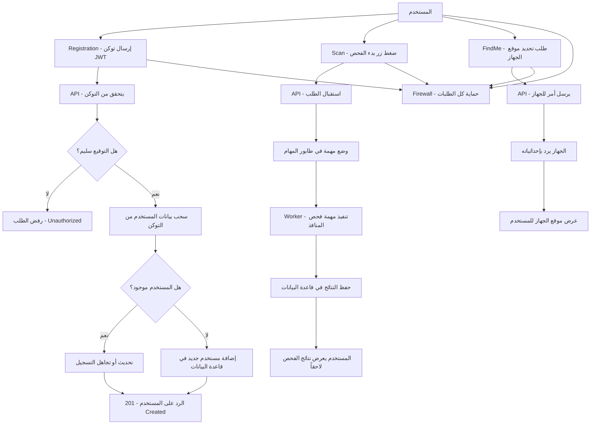

  
[[Registration لتسجيل جهاز جديد في المنصة]]

```mermaid
flowchart TD
    A[المستخدم] --> B[Registration - إرسال توكن JWT]
    B --> C[API - يتحقق من التوكن]
    C --> D{هل التوقيع سليم؟}
    D -- لا --> E[رفض الطلب - Unauthorized]
    D -- نعم --> F[سحب بيانات المستخدم من التوكن]
    F --> G{هل المستخدم موجود؟}
    G -- نعم --> H[تحديث أو تجاهل التسجيل]
    G -- لا --> I[إضافة مستخدم جديد في قاعدة البيانات]
    H & I --> J[الرد على المستخدم - 201 Created]

    A --> K[Scan - ضغط زر بدء الفحص]
    K --> L[API - استقبال الطلب]
    L --> M[وضع مهمة في طابور المهام]
    M --> N[Worker - تنفيذ مهمة فحص المنافذ]
    N --> O[حفظ النتائج في قاعدة البيانات]
    O --> P[المستخدم يعرض نتائج الفحص لاحقاً]

    A --> Q[FindMe - طلب تحديد موقع الجهاز]
    Q --> R[API - يرسل أمر للجهاز]
    R --> S[الجهاز يرد بإحداثياته]
    S --> T[عرض موقع الجهاز للمستخدم]

    A --> U[Firewall - حماية كل الطلبات]
    B --> U
    K --> U
    Q --> U

```

